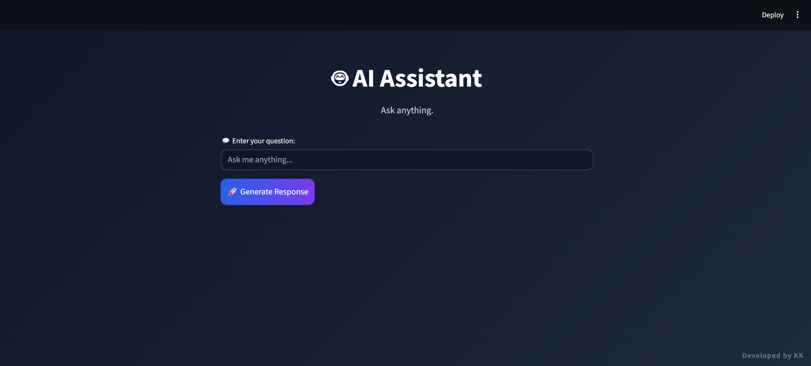
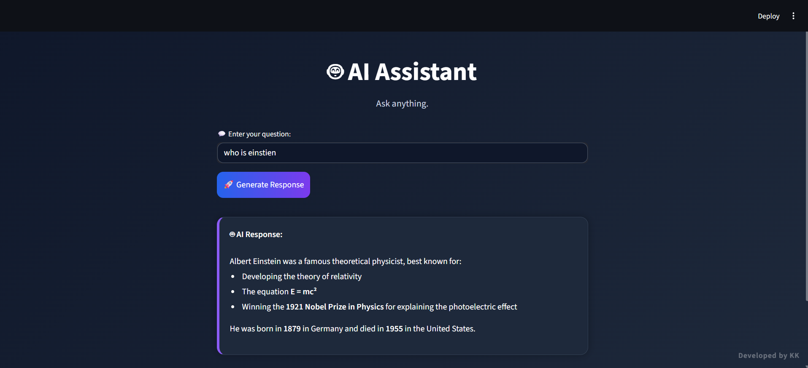

# 🤖 AI Assistant using LangChain + OpenAI

A modern AI Assistant built with **Streamlit**, **LangChain**, and **OpenAI** featuring a clean animated interface, custom styling, and real-time AI responses.

---

## 🚀 Features

- Modern animated UI using Streamlit
- OpenAI integration with LangChain
- Responsive dark theme design
- Real-time AI-generated responses
- Custom CSS styling and animations
- LangSmith tracing support
- Lightweight and beginner-friendly architecture

---

## 🛠️ Tech Stack

- Python
- Streamlit
- LangChain
- OpenAI API
- LangSmith
- HTML/CSS

---

## 📂 Project Structure

```bash
.
├── app.py
├── requirements.txt
├── .env
├── README.md
└── screenshots
    ├── home.png
    └── response.png


```

---

## ⚙️ Installation

### 1. Clone the repository

```bash
git clone https://github.com/keshavk27/SimpleGenAI_assistant
```

### 2. Create virtual environment

#### Windows

```bash
conda create --name venv python=3.10
conda activate venv
```


### 3. Install dependencies

```bash
pip install -r requirements.txt
```

---

## 🔑 Environment Variables

Create a `.env` file in the root directory.


```env
OPENAI_API_KEY=your_openai_api_key

LANGCHAIN_API_KEY=your_langsmith_api_key
LANGCHAIN_PROJECT=your_project_name
```

---

## ▶️ Run the Application

```bash
streamlit run app.py
```

---

## 📸 Screenshots

### Home Screen



### AI Response



---

## 📦 Requirements

Example `requirements.txt`

```txt
langchain
python-dotenv
pypdf
bs4
arxiv
langchain-text-splitters
langchain-openai
chromadb
langchain-community
faiss-cpu
streamlit
```

---

## ⚡ How It Works

1. User enters a question
2. Streamlit sends the input to LangChain
3. LangChain formats the prompt
4. OpenAI generates the response
5. The response is displayed in the animated UI

---

## 🔮 Future Improvements

- Streaming responses
- Voice input support
- File upload support
- RAG integration
- Multi-model support
- Chat history support

---

## 👨‍💻 Author

**KK**

Built using LangChain and OpenAI.

---


